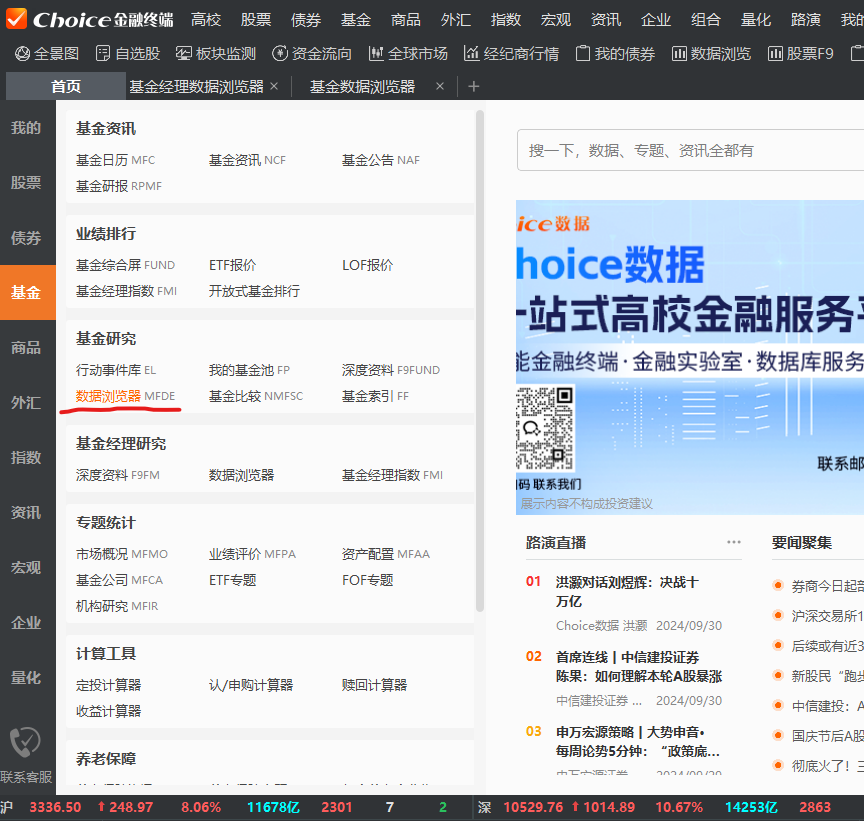

# qqq_fund

### 0 注册登录

search `choice金融终端官网` and download.

### 1 首页

左侧，`基金` - `基金研究` - `数据浏览器` 

### 2 数据浏览器界面

#### 2.1 左下，`基金` - `基金市场类` - `全部基金` 

#### 2.2 左上，`基金全部指标` - `投资组合` - `持仓明细`
> 如果位置有变动在下方搜索框里搜一下 `持仓明细`

双击如`重仓证券名称`后，出现弹窗，
选择 `最新一期`，
下方`名次1` 选择 `第一名`

重复上面步骤，`名次1`选择`第二名`，`第三名`，`第四名`等

#### 2.3 右边上方`提取数据`

点右上角 `导出EXCEL`,获得 excel 表

### 3 统计

上方 数据统计 显示图形
粗略的看下，这上面好像只有一些数值类的统计
那就导出excel 用代码处理一下等

excel 选中列，点筛选，看分类数量